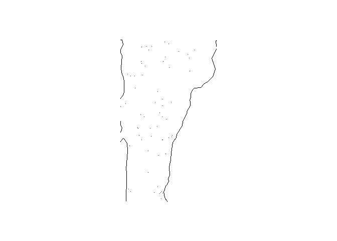

FARS functions README
================

# farsfunctions

<!-- badges: start -->

[](https://github.com/hriisalu/farsfunctions/actions/workflows/R-CMD-check.yaml)
<!-- badges: end -->

## Overview

The `"farsfunctions"` package provides functions to work with the
[Fatality Analysis Reporting System
(FARS)](https://www.nhtsa.gov/research-data/fatality-analysis-reporting-system-fars)
data. FARS is a nationwide census providing annually updated data
regarding fatal injuries suffered in motor vehicle traffic crashes in
the United States.

## Installation

You can install the development version of `"farsfunctions"` package
from GitHub.

``` r
library(devtools)
devtools::install_github("hriisalu/farsfunctions", build_vignettes = TRUE, force = TRUE)
```

## Usage

``` r
# Attaching the package
library(farsfunctions)
```

``` r
# Reading FARS data
fars_read("accident_2013.csv.bz2") %>% 
  head(5)
```

    ## [1] "C:/Users/hriisalu/OneDrive/Documents/Koolitus/Coursera/Building packages/farsfunctions/inst/extdata/accident_2013.csv.bz2"

    ## # A tibble: 5 × 50
    ##   STATE ST_CASE VE_TOTAL VE_FORMS PVH_INVL  PEDS PERNOTMVIT PERMVIT PERSONS COUNTY  CITY   DAY MONTH  YEAR DAY_WEEK  HOUR
    ##   <dbl>   <dbl>    <dbl>    <dbl>    <dbl> <dbl>      <dbl>   <dbl>   <dbl>  <dbl> <dbl> <dbl> <dbl> <dbl>    <dbl> <dbl>
    ## 1     1   10001        1        1        0     0          0       8       8    115     0     6     1  2013        1     0
    ## 2     1   10002        2        2        0     0          0       2       2     55  1670     3     1  2013        5    21
    ## 3     1   10003        1        1        0     0          0       1       1     89  1730     6     1  2013        1    11
    ## 4     1   10004        1        1        0     0          0       3       3     73   350     6     1  2013        1    12
    ## 5     1   10005        2        2        0     0          0       3       3    125  3050     6     1  2013        1    18
    ## # ℹ 34 more variables: MINUTE <dbl>, NHS <dbl>, ROAD_FNC <dbl>, ROUTE <dbl>, TWAY_ID <chr>, TWAY_ID2 <chr>, MILEPT <dbl>,
    ## #   LATITUDE <dbl>, LONGITUD <dbl>, SP_JUR <dbl>, HARM_EV <dbl>, MAN_COLL <dbl>, RELJCT1 <dbl>, RELJCT2 <dbl>,
    ## #   TYP_INT <dbl>, WRK_ZONE <dbl>, REL_ROAD <dbl>, LGT_COND <dbl>, WEATHER1 <dbl>, WEATHER2 <dbl>, WEATHER <dbl>,
    ## #   SCH_BUS <dbl>, RAIL <chr>, NOT_HOUR <dbl>, NOT_MIN <dbl>, ARR_HOUR <dbl>, ARR_MIN <dbl>, HOSP_HR <dbl>, HOSP_MN <dbl>,
    ## #   CF1 <dbl>, CF2 <dbl>, CF3 <dbl>, FATALS <dbl>, DRUNK_DR <dbl>

``` r
# Creating file name
make_filename(2013)
```

    ## [1] "accident_2013.csv.bz2"

``` r
# Reading FARS data for multiple years
fars_read_years(c(2013, 2014)) %>% 
  lapply(head, n = 5)
```

    ## Reading file: accident_2013.csv.bz2 
    ## [1] "C:/Users/hriisalu/OneDrive/Documents/Koolitus/Coursera/Building packages/farsfunctions/inst/extdata/accident_2013.csv.bz2"
    ## Successfully read file for year: 2013 
    ## Reading file: accident_2014.csv.bz2 
    ## [1] "C:/Users/hriisalu/OneDrive/Documents/Koolitus/Coursera/Building packages/farsfunctions/inst/extdata/accident_2014.csv.bz2"
    ## Successfully read file for year: 2014

    ## [[1]]
    ## # A tibble: 5 × 2
    ##   MONTH  year
    ##   <dbl> <dbl>
    ## 1     1  2013
    ## 2     1  2013
    ## 3     1  2013
    ## 4     1  2013
    ## 5     1  2013
    ## 
    ## [[2]]
    ## # A tibble: 5 × 2
    ##   MONTH  year
    ##   <dbl> <dbl>
    ## 1     1  2014
    ## 2     1  2014
    ## 3     1  2014
    ## 4     1  2014
    ## 5     1  2014

``` r
# Summarizing FARS data for multiple years
fars_summarize_years(c(2013, 2014)) %>% 
  head(5)
```

    ## Reading file: accident_2013.csv.bz2 
    ## [1] "C:/Users/hriisalu/OneDrive/Documents/Koolitus/Coursera/Building packages/farsfunctions/inst/extdata/accident_2013.csv.bz2"
    ## Successfully read file for year: 2013 
    ## Reading file: accident_2014.csv.bz2 
    ## [1] "C:/Users/hriisalu/OneDrive/Documents/Koolitus/Coursera/Building packages/farsfunctions/inst/extdata/accident_2014.csv.bz2"
    ## Successfully read file for year: 2014

    ## # A tibble: 5 × 3
    ##   MONTH `2013` `2014`
    ##   <dbl>  <int>  <int>
    ## 1     1   2230   2168
    ## 2     2   1952   1893
    ## 3     3   2356   2245
    ## 4     4   2300   2308
    ## 5     5   2532   2596

``` r
# Mapping FARS data for a specific state and year
fars_map_state(50, 2013)
```

    ## [1] "C:/Users/hriisalu/OneDrive/Documents/Koolitus/Coursera/Building packages/farsfunctions/inst/extdata/accident_2013.csv.bz2"

<!-- -->

For more detailed information on each function, refer to the function
documentation.

## License

GPL
