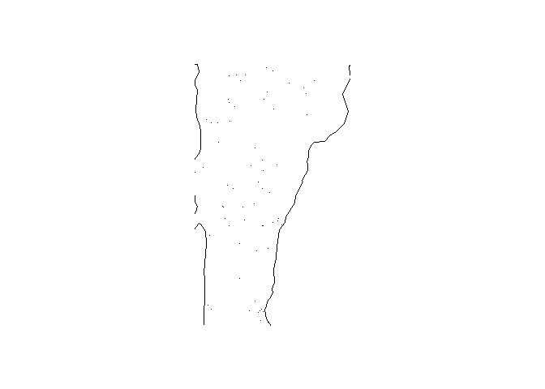

FARS functions README
================

# farsfunctions

<!-- badges: start -->

[](https://github.com/hriisalu/farsfunctions/actions/workflows/R-CMD-check.yaml)
<!-- badges: end -->

## Overview

The `"farsfunctions"` package provides functions to work with the
[Fatality Analysis Reporting System
(FARS)](https://www.nhtsa.gov/research-data/fatality-analysis-reporting-system-fars)
data. FARS is a nationwide census providing annually updated data
regarding fatal injuries suffered in motor vehicle traffic crashes in
the United States.

## Installation

You can install the development version of `"farsfunctions"` package
from GitHub.

``` r
library(devtools)
devtools::install_github("hriisalu/farsfunctions", build_vignettes = TRUE, force = TRUE)
```

    ## ── R CMD build ─────────────────────────────────────────────────────────────────
    ##          checking for file 'C:\Users\hriisalu\AppData\Local\Temp\Rtmp6B5PJ0\remotes5d1032667470\hriisalu-farsfunctions-82cfcea/DESCRIPTION' ...  ✔  checking for file 'C:\Users\hriisalu\AppData\Local\Temp\Rtmp6B5PJ0\remotes5d1032667470\hriisalu-farsfunctions-82cfcea/DESCRIPTION'
    ##       ─  preparing 'farsfunctions':
    ##    checking DESCRIPTION meta-information ...  ✔  checking DESCRIPTION meta-information
    ##       ─  installing the package to build vignettes
    ##          creating vignettes ...     creating vignettes ...   ✔  creating vignettes (6.4s)
    ##       ─  checking for LF line-endings in source and make files and shell scripts
    ##   ─  checking for empty or unneeded directories
    ##    Omitted 'LazyData' from DESCRIPTION
    ##       ─  building 'farsfunctions_0.1.0.tar.gz'
    ##      
    ## 

## Using

### Attaching the package

``` r
library(farsfunctions)
```

### Reading FARS data

The `"fars_read"` function allows users to read FARS data from a csv
file. It takes the path to the csv file as input and returns a tibble
containing the data. If the file does not exist, an error message is
displayed.

``` r
# Example
fars_read("accident_2013.csv.bz2") %>% 
  head(5)
```

    ## [1] "C:/R/R/library/farsfunctions/extdata/accident_2013.csv.bz2"

    ## # A tibble: 5 × 50
    ##   STATE ST_CASE VE_TOTAL VE_FORMS PVH_INVL  PEDS PERNOTMVIT PERMVIT PERSONS
    ##   <dbl>   <dbl>    <dbl>    <dbl>    <dbl> <dbl>      <dbl>   <dbl>   <dbl>
    ## 1     1   10001        1        1        0     0          0       8       8
    ## 2     1   10002        2        2        0     0          0       2       2
    ## 3     1   10003        1        1        0     0          0       1       1
    ## 4     1   10004        1        1        0     0          0       3       3
    ## 5     1   10005        2        2        0     0          0       3       3
    ## # ℹ 41 more variables: COUNTY <dbl>, CITY <dbl>, DAY <dbl>, MONTH <dbl>,
    ## #   YEAR <dbl>, DAY_WEEK <dbl>, HOUR <dbl>, MINUTE <dbl>, NHS <dbl>,
    ## #   ROAD_FNC <dbl>, ROUTE <dbl>, TWAY_ID <chr>, TWAY_ID2 <chr>, MILEPT <dbl>,
    ## #   LATITUDE <dbl>, LONGITUD <dbl>, SP_JUR <dbl>, HARM_EV <dbl>,
    ## #   MAN_COLL <dbl>, RELJCT1 <dbl>, RELJCT2 <dbl>, TYP_INT <dbl>,
    ## #   WRK_ZONE <dbl>, REL_ROAD <dbl>, LGT_COND <dbl>, WEATHER1 <dbl>,
    ## #   WEATHER2 <dbl>, WEATHER <dbl>, SCH_BUS <dbl>, RAIL <chr>, NOT_HOUR <dbl>, …

### Creating file name

The `"make_filename"` function generates the filename for a FARS data
file based on the input year.

``` r
# Example
make_filename(2013)
```

    ## [1] "accident_2013.csv.bz2"

### Reading FARS data for multiple years

The `"fars_read_years"` function reads FARS data for multiple years and
combines them into a tibble. It takes a vector of years as input and
returns a list of tibbles, each containing data for a specific year.

``` r
# Example
fars_read_years(c(2013, 2014)) %>% 
  lapply(head, n = 5)
```

    ## Reading file: accident_2013.csv.bz2 
    ## [1] "C:/R/R/library/farsfunctions/extdata/accident_2013.csv.bz2"
    ## Successfully read file for year: 2013 
    ## Reading file: accident_2014.csv.bz2 
    ## [1] "C:/R/R/library/farsfunctions/extdata/accident_2014.csv.bz2"
    ## Successfully read file for year: 2014

    ## [[1]]
    ## # A tibble: 5 × 2
    ##   MONTH  year
    ##   <dbl> <dbl>
    ## 1     1  2013
    ## 2     1  2013
    ## 3     1  2013
    ## 4     1  2013
    ## 5     1  2013
    ## 
    ## [[2]]
    ## # A tibble: 5 × 2
    ##   MONTH  year
    ##   <dbl> <dbl>
    ## 1     1  2014
    ## 2     1  2014
    ## 3     1  2014
    ## 4     1  2014
    ## 5     1  2014

### Summarizing FARS data for multiple years

The `"fars_summarize_years"` function summarizes FARS data for multiple
years, counting accidents per month. It takes a vector of years as input
and returns a tibble summarizing the number of accidents per month for
each year.

``` r
# Example
fars_summarize_years(c(2013, 2014)) %>% 
  head(5)
```

    ## Reading file: accident_2013.csv.bz2 
    ## [1] "C:/R/R/library/farsfunctions/extdata/accident_2013.csv.bz2"
    ## Successfully read file for year: 2013 
    ## Reading file: accident_2014.csv.bz2 
    ## [1] "C:/R/R/library/farsfunctions/extdata/accident_2014.csv.bz2"
    ## Successfully read file for year: 2014

    ## # A tibble: 5 × 3
    ##   MONTH `2013` `2014`
    ##   <dbl>  <int>  <int>
    ## 1     1   2230   2168
    ## 2     2   1952   1893
    ## 3     3   2356   2245
    ## 4     4   2300   2308
    ## 5     5   2532   2596

### Mapping FARS data for a specific state and year

The `"fars_summarize_years"` function shows FARS data on a map for a
specific state and year. It takes the state number and year as input and
returns a plot of FARS data on a map.

``` r
# Example
fars_map_state(50, 2013)
```

    ## [1] "C:/R/R/library/farsfunctions/extdata/accident_2013.csv.bz2"

<!-- -->

For more detailed information on each function, refer to the function
documentation.

## License

GPL
